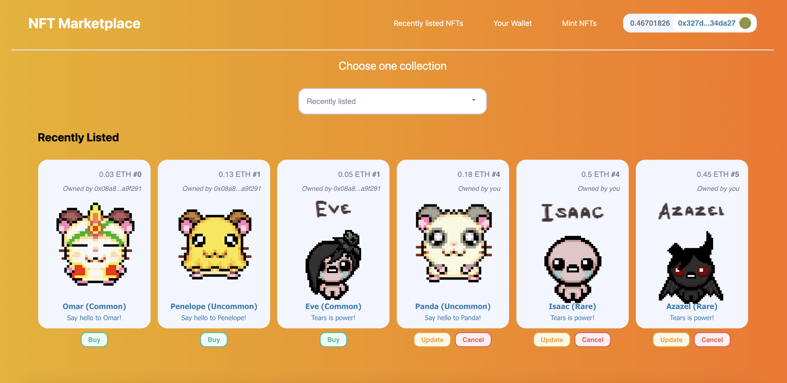
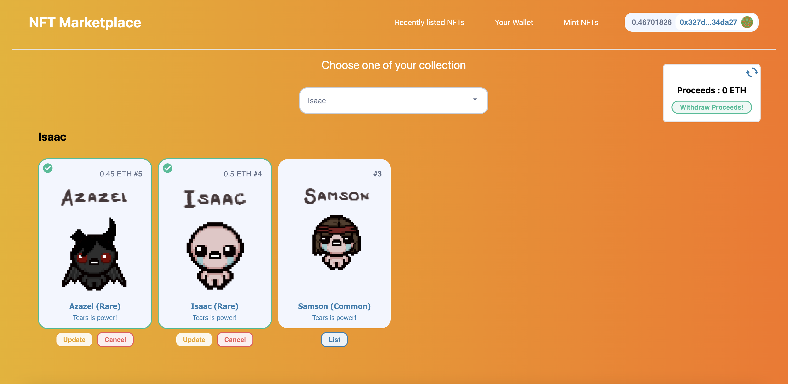

# NFT Marketplace frontend





This is a repository to give a user interface on the NFT Marketplace contracts.
This repository is the frontend repository of the [NFT Marketplace contracts](https://github.com/jrmunchkin/nft-marketplace). However you absolutly can use this repository without the backend part.

## Summary

### NFT Marketplace

The NFT Marketplace contract creates a NFT marketplace where any NFT collection can be listed or bought
Every user can withdraw the ETH from the NFT they sold.

The NFT Marketplace allow you to :

- `listNft`: List a NFT on the marketplace with a given ETH price from any collection.
- `buyNft`: Buy a NFT on the marketplace from any collection.
- `updateNftListing`: Update the ETH price of your listed NFTs.
- `cancelNftListing`: Cancel the listing of your NFT.
- `withdrawProceeds`: Withdraw the ETH from the NFTs you sold on the Marketplace.

### NFT Collections

This repository comes with 2 NFTs contract, each creating a NFT collection.
The constructor takes a mint fee in ETH and an array of token uris for each characters of the collection.

This contract implements :

- Chainlink VRF to pick a random NFT when the user mint.

The NFT Collections allows you to :

- `mintFreeNft`: Mint a maximum of 3 free NFTs.
- `mintNft`: Mint an NFT buy paying mint fees.

- [NFT Marketplace](#nft-marketplace-frontend)
  - [Summary](#summary)
    - [NFT Marketplace](#nft-marketplace)
    - [NFT Collections](#nft-collections)
  - [Prerequisites](#prerequisites)
  - [Installation](#installation)
  - [Testing](#testing)

## Prerequisites

Please install or have installed the following:

- [git](https://git-scm.com/book/en/v2/Getting-Started-Installing-Git)
- [nodejs](https://nodejs.org/en/download/)
- [yarn](https://yarnpkg.com/getting-started/install) instead of `npm`

## Installation

1. Clone this repository

```
git clone https://github.com/jrmunchkin/nft-marketplace-front-end
cd nft-marketplace-front-end
```

2. Install dependencies and run the code

```
yarn
yarn dev
```

3. Set variables

Set your `MORALIS_API_KEY` in your env file. To get a moralis API key you should create an [Moralis account](https://admin.moralis.io/) and find your key under the Web3 APIs menu.

Also be sure to replace the graph uri in the \_app.js file with your own uri (see [thegraph repository](https://github.com/jrmunchkin/nft-marketplace-graph)).

## Testing

The Application can be use locally thanks to hardhat node with the [backend repository](https://github.com/jrmunchkin/nft-marketplace). You need to add the hardhat network in your metamask and export an account.

You also can use goerli network. Be sure to connect with goerli network on your metamask.
